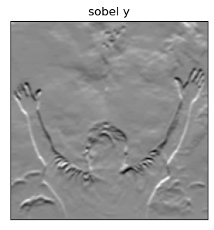

# EDGE-DETECTION
## Aim:
To perform edge detection using Sobel, Laplacian, and Canny edge detectors.

## Software Required:
Anaconda - Python 3.7

## Algorithm:
### Step1:
Import all the necessary modules for the program.

### Step2:
Load a image using imread() from cv2 module.

### Step3:
Convert the image to grayscale

### Step4:
Using Sobel operator from cv2,detect the edges of the image.

### Step5:

Using Laplacian operator from cv2,detect the edges of the image and Using Canny operator from cv2,detect the edges of the image.

## Program:
```py
# Import the packages
import cv2
import numpy as np
import matplotlib.pyplot as plt
# loading image
image=cv2.imread("holi.jpeg")
# converting to gray scale
img=cv2.cvtColor(image,cv2.COLOR_BGR2GRAY)
# remove noise
img1=cv2.GaussianBlur(img,(3,3),0)
# convolve with proper kernels
# Sobel X:
sobelx = cv2.Sobel(img1,cv2.CV_64F,1,0,ksize=5)
plt.figure(figsize=(8,8))
plt.subplot(1,2,1)
plt.imshow(img1,cmap='gray')
plt.title('Original')
plt.subplot(1,2,1)
plt.imshow(sobelx,cmap='gray')
plt.title("sobel x")
plt.xticks([])
plt.yticks([])
plt.show()
# Sobel Y:
sobely = cv2.Sobel(img1,cv2.CV_64F,0,1,ksize=5)
plt.figure(figsize=(8,8))
plt.subplot(1,2,1)
plt.imshow(img1,cmap='gray')
plt.title('Real')
plt.subplot(1,2,1)
plt.imshow(sobely,cmap='gray')
plt.title("sobel y")
plt.xticks([])
plt.yticks([])
plt.show()
# Sobel XY:
sobelxy = cv2.Sobel(img1,cv2.CV_64F,1,1,ksize=5)
plt.figure(figsize=(8,8))
plt.subplot(1,2,1)
plt.imshow(img1,cmap='gray')
plt.title('real')
plt.subplot(1,2,1)
plt.imshow(sobelxy,cmap='gray')
plt.title("sobel xy")
plt.xticks([])
plt.yticks([])
plt.show()
# Laplacian
laplacian = cv2.Laplacian(img1,cv2.CV_64F)
plt.figure(figsize=(8,8))
plt.subplot(1,2,1)
plt.imshow(img1,cmap='gray')
plt.title('ReAl')
plt.subplot(1,2,1)
plt.imshow(laplacian,cmap='gray')
plt.title("Laplacian")
plt.xticks([])
plt.yticks([])
plt.show()
# Canny Edges
canny_edges = cv2.Canny(img1, 120, 150)
plt.figure(figsize=(8,8))
plt.subplot(1,2,1)
plt.imshow(img1,cmap='gray')
plt.title('ReaL')
plt.subplot(1,2,1)
plt.imshow(canny_edges,cmap='gray')
plt.title("Canny")
plt.xticks([])
plt.yticks([])
plt.show()

```
## Output:
### SOBEL EDGE DETECTOR



### LAPLACIAN EDGE DETECTOR

### CANNY EDGE DETECTOR


## Result:
Thus the edges are detected using Sobel, Laplacian, and Canny edge detectors.